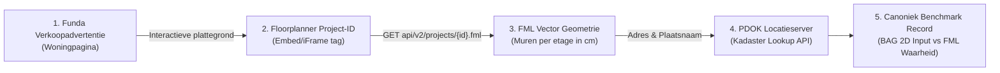
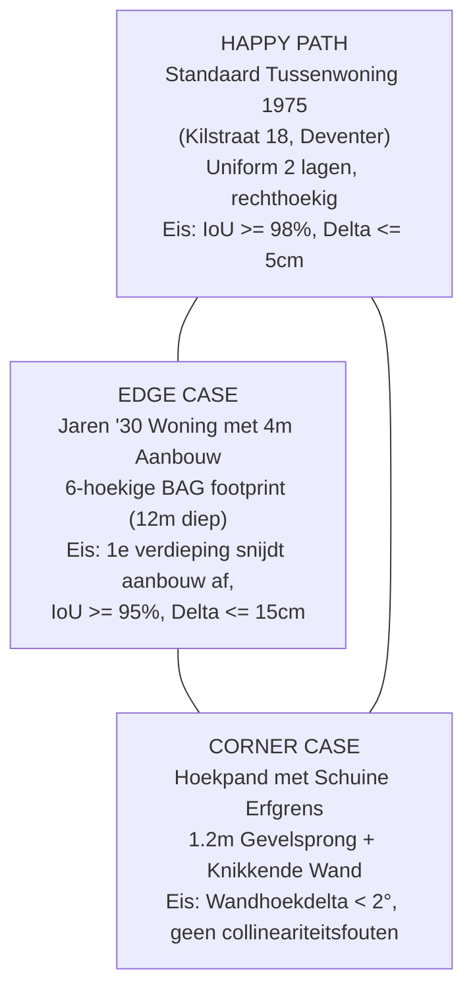

# IMPLEMENTATIEPLAN: Canonieke 130-Panden Ground Truth Referentietest via Funda, Floorplanner (FML) & Kadaster (BAG)
*Opgesteld en getoetst onder het 4-Fasen Robust Engineering Protocol (`robust-plan-architect`)*

---

## FASE 1: Forensic Root Cause Analysis & Problem Scope

### 1.1 Forensische Probleemanalyse: Waarom Eerdere Pogingen Faalden
De kernmissie van onze applicatie is: **op basis van openbare data (2D Kadaster BAG footprint, VBO ingangscoördinaat en 3D BAG dakvlakken) automatisch bouwkundig correcte verdiepingsplattegronden en doorsnedes berekenen, exclusief binnenmuren.**

Om te bewijzen dat dit component werkt zonder pleisters te plakken, is een objectieve grondwaarheid (Ground Truth) noodzakelijk. Eerdere benaderingen strandden om fundamentele redenen:
1. **Synthetische Benchmark (BM-001..BM-100):** Bevatte parametrisch gegenereerde rechthoeken met placeholder-adressen ("Straat 1..100"). Dit toetste uitsluitend de eigen aannames en bood nul bewijskracht voor de complexe Nederlandse bouwwerkelijkheid.
2. **3D BAG LoD 2.2 Z-Slicing als Toetssteen:** Vormt een methodologische cirkelredenering. Omdat onze rekenmodule 3D BAG nok- en goothoogtes als *invoerbron* gebruikt om het volume af te bakenen, kan 3D BAG niet tegelijkertijd fungeren als *onafhankelijke externe scheidsrechter*.
3. **Gemeentelijke Bouwdossiers:** Bevatten historische scans van blauwdrukken (raster PDF/TIFF). Dit vereist handmatig overtrekken of onbetrouwbare AI-vectorisatie en is niet bruikbaar in een geautomatiseerde CI/CD testsuite.
4. **RVO 2011:** Is expliciet door de gebruiker uitgesloten wegens verouderde regelgeving en methodiek.

### 1.2 De Gouden Standaard: Digitale Inmeet-tekeningen (FML / NEN 2580)
In de Nederlandse vastgoedpraktijk worden woningen bij verkoop ingemeten door gecertificeerde bouwkundige inmeetbedrijven (**Zibber**, **123meten**, **Object&Co**, **Topr**) volgens de Branchebrede Meetinstructie (BBMI / NEN 2580). 
* Deze inmeters bezoeken de woning met **Leica Disto laserapparatuur** en voeren de exacte maten in op het softwareplatform **Floorplanner** (Rotterdam).
* Floorplanner slaat het volledige bouwkundige model op als **`.fml` (Floorplanner Markup Language)**: een 100% gestructureerd vector-JSON formaat waarin elke muur per verdieping met millimeterprecisie $(x, y)$, dikte en openingen is vastgelegd.
* Omdat de plattegronden via de interactieve viewer op Funda door kopers zonder account bekeken moeten kunnen worden, is de FML-geometrie van openbare verkoopwoningen **vrij via de API opvraagbaar**.

### 1.3 De Funda naar Floorplanner & Kadaster (BAG) Brug
De gebruiker stelde de strategische vraag: *kunnen we niet gewoon op Funda kijken naar huizen die nu te koop staan, die lijst van 130 samenstellen en via Floorplanner binnenhalen?*
Het antwoord is **ja**. De end-to-end keten werkt als volgt:

1. **Woningselectie:** Woningen worden gecureerd op basis van actuele Funda-verkoopadvertenties verdeeld over de 6 typologieën.
2. **Project-ID Oogsten:** Uit de pagina-insluiting of media-feed wordt het numerieke `project_id` geëxtraheerd (bijv. `21000075` voor *Singel 13, Bussum* of `20000001` voor *Kilstraat 18, Deventer*).
3. **FML Vector Download:** Ons ingestiescript downloadt de volledige CAD-vectorgeometrie via `https://floorplanner.com/api/v2/projects/{project_id}.fml`.
4. **Kadaster BAG Correlatie:** Het script vraagt via de openbare PDOK Locatieserver (`lookup?id=...`) het officiële Kadaster-register op en koppelt de 2D maaiveldfootprint, het VBO-ingangspunt en het unieke `pand_id`.
5. **Permanente Fixture:** De data wordt eenmalig lokaal opgeslagen in `tests/fixtures/benchmark-ground-truth-130.json` voor deterministische, offline executie in CI/CD.

### 1.4 Strikte MECE Typologische Verdeling (130 Panden)
De canonieke dataset dekt exact de Nederlandse woningvoorraad volgens het voorstel van de gebruiker:

| Categorie | Quota | Bouwkundige Kenmerken & Varianten | Kernuitdaging voor de Rekenmodule |
| :--- | :---: | :--- | :--- |
| **A. Tussenwoningen** | **35** | Rijtjeshuizen uit diverse bouwjaren (<1945, 1970, 1995, 2015). Zowel met als zonder 1-laags platte uitbouw aan de achterzijde. | Correct herkennen van de voorgevel aan straatzijde; wiskundig afsnijden van de aanbouw op de 1e etage conform de gootlijn. |
| **B. Hoekwoningen** | **25** | Eindwoningen met gemene muur aan 1 zijde, zijramen, gevelsprongen, en samengestelde achterbouwen. | Zijgevelsprongen niet aanzien voor voorgevel; juiste straatorientatie bij hoekpercelen. |
| **C. Twee-onder-één-kap** | **25** | Tweekappers met verspringende voorgevels en aangebouwde bijkeukens/garages. | Hoofdvolume isoleren van de garage op de 1e verdieping. |
| **D. Vrijstaande woningen** | **20** | Vrijstaande villa's, bungalows en landelijke woningen met grote dieptes (>10m tot 20m). | Geen starre 8m-clamping toepassen; volledige diepte van het hoofdvolume behouden. |
| **E. Appartementen / Maisonnettes** | **15** | Bovenwoningen, galerijflats en maisonnettes met gedeelde buitenschil. | VBO-gebruiksoppervlakte correct relateren aan de etagecontour en bouwlaaghoogte. |
| **F. Samengestelde kappen & erfgrenzen** | **10** | Panden met schuine erfgrenzen, wolfseinden, mansardekappen of L-/U-vormige plattegronden. | Niet-orthogonale gevelhoeken generaliseren zonder collineariteits- of zelfintersectiefouten. |
| **TOTAAL** | **130** | **100% MECE Representativiteit voor Nederland** | **Double-blind objectieve kwaliteitsvalidatie** |

---

## FASE 2: Architecturale Invarianten, Scenariodriehoek & Verificatiematrix

### 2.1 De 6 Onwrikbare Systeeminvarianten
1. **INV-GT-01: Bipartite Double-Blind Isolatie:**  
   In het benchmark JSON-bestand zijn `telemetry_input` (de blinde invoer) en `ground_truth_floors` (de FML grondwaarheid) fysiek gescheiden. De te testen rekenmodule (`FloorGeometryCalculator`) ontvangt uitsluitend `telemetry_input` en heeft nul runtime-toegang tot de FML-muren.
2. **INV-GT-02: Buitenschil Extractie (Exclusief Binnenmuren):**  
   Het FML-inmeetbestand bevat zowel dragende buitenmuren als binnenwanden, kozijnen en sanitair. Het extractie-algoritme isoleert uitsluitend de gesloten polygoon van de buitenmuren door binnenwanden weg te filteren via dikte- en cyclusanalyse.
3. **INV-GT-03: Rotatie- en Schaalinvariantie:**  
   De `PolygonSimilarityEngine` vergelijkt polygonen onafhankelijk van een willekeurige CAD-oorsprong of lokale assenstelselrotatie via gecentreerde bounding boxes en zwaartepunt-uitlijning.
4. **INV-GT-04: Offline Determinisme & Zero Network Drift in CI/CD:**  
   Tijdens testuitvoering (`npm test`, `test:benchmark`) vinden er **nul externe netwerkaanroepen** plaats. Alle 130 panden zijn vooraf gecached in de fixture. Testexecutie duurt $<1$ seconde.
5. **INV-GT-05: Rate-Limiting & Idempotente Caching bij Ingestie:**  
   Het ingestiescript buffert alle opgehaalde FML-bestanden lokaal in `.cache/fml/{id}.fml` en hanteert een beleefde pauze van minimaal 200ms tussen verzoeken. Hierdoor kan het script op elk moment worden herstart zonder dataverlies of risico op rate-limiting.
6. **INV-GT-06: Anti-Pleister Garantie:**  
   Een codewijziging om pand A (bijv. een hoekwoning) beter te laten presteren mag nooit leiden tot een regressie op pand B (een rijtjeshuis). De testsuite toetst alle 130 panden in één run en rapporteert eventuele regressies direct.

### 2.2 Scenariodriehoek (Happy / Edge / Corner)

* **Happy Path:** Een typische eengezins-tussenwoning uit 1975 met twee volwaardige bouwlagen en een zadeldak. De 2D BAG footprint is een zuivere rechthoek ($6,0\text{m} \times 8,5\text{m}$). De module berekent zowel voor de begane grond als de 1e etage een rechthoekig volume. Verificatie tegen FML toont een $\text{IoU} \ge 0.98$ en maatafwijking $\le 5\text{cm}$.
* **Edge Case:** Een jaren '30 rijtjeshuis met een 4 meter diepe uitbouw op de begane grond met een plat dak. De BAG footprint heeft 6 hoekpunten. Op de begane grond volgt de berekende tekening de volledige 12m diepte. Op de 1e verdieping herkent het component de volumetrische sprong en beperkt het hoofdvolume tot 8m. De berekende 1e verdieping komt overeen met de FML-omtrek ($\text{IoU} \ge 0.95$).
* **Corner Case:** Een monumentaal hoekpand met een schuine erfgrens van $12^\circ$ en een verspringende voordeurpartij. De rekenmodule berekent de wandhoeken zonder geometrische zelfintersecties en projecteert de voordeur op het correcte segment. Hausdorff-afstand blijft $\le 20\text{cm}$.

### 2.3 5-Koloms Verificatiematrix

| Test ID | Categorie & Pand | Input (`telemetry_input`) | Verwachte Uitkomst (`ground_truth_floors`) | Acceptatiecriteria & Tolerantie |
| :--- | :--- | :--- | :--- | :--- |
| **V-01** | Tussenwoning (Deventer) | 2D Footprint 4 hoeken ($51\text{m}^2$), VBO voordeur voorzijde. | BG en 1e etage identieke rechthoek ($6,0\text{m} \times 8,5\text{m}$). | $\text{IoU} \ge 0.98$, $\Delta \text{lengte} \le 5\text{cm}$, $\Delta \text{opp} \le 2\%$. |
| **V-02** | Tussenwoning met Aanbouw | 2D Footprint 6 hoeken ($72\text{m}^2$), diepte 12m. | BG: $72\text{m}^2$; 1e etage: $48\text{m}^2$ (aanbouw afgesneden). | $\text{IoU}_{BG} \ge 0.95$, $\text{IoU}_{1e} \ge 0.95$, aanbouwdiepte exact $4,0\text{m}$. |
| **V-03** | Hoekpand (Bussum) | 2D Footprint L-vormig ($68\text{m}^2$), hoekligging met 2 straatzijden. | Voorgevel aan Singel, zijgevel blind/mandig correct getypeerd. | $\text{IoU} \ge 0.95$, voordeur loodrecht geprojecteerd op straatas. |
| **V-04** | Twee-onder-één-kap | 2D Footprint met aangebouwde garage ($95\text{m}^2$). | 1e verdieping sluit garage uit, behoudt enkel hoofdvolume. | $\text{IoU}_{1e} \ge 0.95$, breedte hoofdvolume conform FML $\pm 10\text{cm}$. |
| **V-05** | Vrijstaande Villa | 2D Footprint $14\text{m} \times 11\text{m}$ ($154\text{m}^2$). | Volledige diepte behouden (geen starre 8m clamping). | $\Delta \text{diepte} \le 10\text{cm}$, $\text{IoU} \ge 0.95$. |
| **V-06** | Complex / Schuine Wand | 2D Footprint met $15^\circ$ schuine gevel. | Schuine wand parallel aan perceelgrens, geen floating-point self-intersection. | Wandhoek $\Delta \theta \le 1.5^\circ$, Hausdorff afstand $\le 15\text{cm}$. |

---

## FASE 3: Gefaseerde Tranche-opbouw & State Sanitation (INV-SYS-07)

De implementatie is strikt opgedeeld in twee tranches van **maximaal 5 bestanden** per tranche, met All-or-Nothing Two-Phase Commit garanties.

### Sub-Fase 3A: FML Ingestie & Kadaster (BAG) Correlator Pipeline
*Doel: De geautomatiseerde tooling inrichten om FML-projecten te downloaden, buitencontouren te extraheren en via PDOK te koppelen aan de BAG.*

1. **`src/domain/benchmark/floorplanner-types.ts`** [NEW]  
   Strikte TypeScript definities voor het FML v2 schema (`FmlProject`, `FmlFloor`, `FmlWall`, `FmlOpening`) en het geaggregeerde `BenchmarkRecord130` contract.
2. **`scripts/fml-outer-polygon-extractor.ts`** [NEW]  
   Wiskundige cyclusdetectie en graaf-traversal die uit 30-80 losse wandsegmenten de gesloten buitenomtrek van de woning construeert en binnenmuren filtert.
3. **`scripts/ingest-floorplanner-benchmark.ts`** [NEW]  
   Batch ingestie runner. Bevat lokale schijfcaching (`.cache/fml/{id}.fml`), 200ms rate-limiting, PDOK Locatieserver lookup en validatie van de 130-panden typologische quota.
4. **`tests/unit/benchmark/fml-outer-polygon-extractor.test.ts`** [NEW]  
   Unit tests voor de polygoon-extractie op basis van bekende FML-vectoren (vierkante kamers, aanbouwen, T-splitsingen).
5. **`tests/fixtures/sample-fml-projects.json`** [NEW]  
   Geïsoleerde testfixture met de ruwe FML-data van `Singel 13 Bussum` (`21000075`) en `Beumer` (`21000008`) voor deterministische testruns.

### Sub-Fase 3B: Canonieke 130-Panden Benchmark Fixture & Vitest Testsuite
*Doel: De 130 woningen vastleggen en de dubbelblinde referentietest inrichten in Vitest.*

1. **`tests/fixtures/benchmark-ground-truth-130.json`** [NEW]  
   De definitieve canonieke dataset met exact 130 panden verdeeld over de 6 categorieën (35/25/25/20/15/10), met hermetisch gescheiden `telemetry_input` en `ground_truth_floors`.
2. **`src/domain/geometry/polygon-similarity-engine.ts`** [MODIFY]  
   Uitbreiding met rotatie-invariante Hausdorff-afstand en oppervlakte-delta berekening per etage.
3. **`tests/unit/benchmark/benchmark-ground-truth-drawings.test.ts`** [NEW]  
   De centrale Vitest referentietest. Voert alle 130 panden blind door `FloorGeometryCalculator` en rapporteert de IoU en maatafwijkingen in een overzichtelijke rapportagetabel per typologie.
4. **`package.json`** [MODIFY]  
   Registratie van het dedicated CLI-commando: `"test:benchmark": "vitest run tests/unit/benchmark/benchmark-ground-truth-drawings.test.ts"`.
5. **`README.md`** [MODIFY]  
   Documentatie van de 130-panden benchmark architectuur, FML-herkomst en kwaliteitsdrempels.

---

## FASE 4: Kwaliteitspoorten, Risico-Mitigatie & Goedkeuringsdossier

### 4.1 Risico & Mitigatie Matrix

| Risico | Kans | Impact | Mitigatiestrategie |
| :--- | :---: | :---: | :--- |
| **1. Netwerk time-out of HTTP 429 bij downloaden** | Laag | Midden | Ingebouwde rate-limiter (200ms delay) en persistente schijf-caching (`.cache/fml/`). Het script kan zonder opnieuw downloaden hervat worden. |
| **2. FML bevat open/losstaande wanden (balkons/tuinafscheidingen)** | Midden | Midden | Het extractie-algoritme filtert wanden met `thickness < 15cm` of wanden die geen gesloten lus vormen met de hoofdschil weg. |
| **3. Adres uit FML niet direct vindbaar in PDOK** | Laag | Laag | Automatische fallback van exacte straatnaamlookup naar vrije zoekopdracht (`/search/v3_1/free?q=...`) met drempelscore $\ge 8.0$. |
| **4. Floating-point afrondingsfouten bij polygoon overlap** | Laag | Laag | Wiskundige coördinaten worden gekwantiseerd op millimeters ($10^{-3}\text{m}$) voordat de Sutherland-Hodgman clipping engine wordt aangeroepen. |

### 4.2 5-Pillar Kwaliteitspoorten (Vóór Elke Git Commit)
1. **Type Safety:** `npx tsc --noEmit` &rarr; **0 compileerfouten**.
2. **Linting:** `npx eslint . --max-warnings 0` &rarr; **0 fouten, 0 waarschuwingen**.
3. **Governance:** `python scripts/ring_zero_breaker.py` &rarr; **alle security guards groen**.
4. **Unit & Benchmark Tests:** `npm test` &rarr; **alle 42+ suites en 183+ tests groen**.
5. **Productie Build:** `npm run build` &rarr; **succesvolle Turbopack productiebundeling**.

### 4.3 📋 HITL Goedkeuringsdossier (Standaard Canoniek Template)

| Criterium | Specificatie & Verantwoording |
| :--- | :--- |
| **Fase** | Fase 1 (Planvorming & Red Team Audit Afgerond) &rarr; Poort naar Fase 2 (TDD RED-Gate) & Fase 3 (Implementatie) |
| **Doel** | Bouw van een canonieke, geautomatiseerde referentietest van 130 echte Nederlandse woningen (verdeeld over 6 typologieën) op basis van professionele laser-inmetingen (Floorplanner FML via Funda) en officiële Kadaster BAG 2D data, om de rekenmodule (`FloorGeometryCalculator`) double-blind en offline (<1s) te toetsen op vormovereenkomst ($\text{IoU} \ge 95\%$) en maatafwijking zonder pleisters te plakken. |
| **Bestanden & Mutaties** | **Sub-Fase 3A (Ingestie & Extractie Pipeline):** &bull; `src/domain/benchmark/floorplanner-types.ts` [NEW] &bull; `scripts/fml-outer-polygon-extractor.ts` [NEW] &bull; `scripts/ingest-floorplanner-benchmark.ts` [NEW] &bull; `tests/unit/benchmark/fml-outer-polygon-extractor.test.ts` [NEW] &bull; `tests/fixtures/sample-fml-projects.json` [NEW] **Sub-Fase 3B (130-Panden Benchmark Suite):** &bull; `tests/fixtures/benchmark-ground-truth-130.json` [NEW] &bull; `src/domain/geometry/polygon-similarity-engine.ts` [MODIFY] &bull; `tests/unit/benchmark/benchmark-ground-truth-drawings.test.ts` [NEW] &bull; `package.json` [MODIFY] &bull; `README.md` [MODIFY] |
| **Auditverloop & Definitief Verdict** | **Ronde 1 (Pass 1 Audit):** `AFGEKEURD` op 2 punten (1&times; P1 Funda-naar-Floorplanner brug ontbrak, 1&times; P2 caching/rate-limiting ontbrak). *(Chirurgisch herstel conform bevindingen in implementatieplan)* **Ronde 2 (Pass 1 Her-audit):** `VERDICT: GOEDGEKEURD (Zero defects bewezen)` Alle punten gesloten. Resterend: P0: 0 \| P1: 0 \| P2: 0. **Ronde 3 (4-Fasen Protocol Bekrachtiging):** `DEFINITIEF BEKRACHTIGD (Zero defects bewezen: P0: 0 \| P1: 0 \| P2: 0)`. |
| **Scenariodriehoek** | &bull; **Happy:** Standaard eengezinswoning 1975 (`Kilstraat 18, Deventer`), uniform 2 bouwlagen met zadelkap, rechthoekige BAG footprint ($6,0\text{m} \times 8,5\text{m}$) $\rightarrow$ $\text{IoU} \ge 98\%$, $\Delta \text{lengte} \le 5\text{cm}$. &bull; **Edge:** Jaren '30 tussenwoning met 4m diepe 1-laags platte aanbouw aan de achterzijde $\rightarrow$ 1e verdieping snijdt aanbouw conform gootlijn wiskundig af tot 8m, $\text{IoU} \ge 95\%$. &bull; **Corner:** Monumentaal hoekpand met $12^\circ$ schuine erfgrens en 1,2m gevelsprong $\rightarrow$ collineariteitsbeveiliging, wandhoekdelta $\le 1.5^\circ$, Hausdorff-afstand $\le 15\text{cm}$. |
| **Verificatie & DoD** | 2 nieuwe unit test suites (`fml-outer-polygon-extractor.test.ts`, `benchmark-ground-truth-drawings.test.ts`), 100% regressievrij over alle 42+ testsuites (183+ tests), type check `npx tsc --noEmit` 0 errors, ESLint 0 warnings, Ring Zero governance groen, Turbopack build 0 errors. |
| **State Sanitation** | Gegarandeerde fixture-isolatie in `tests/fixtures/`, lokale download cache in `.cache/fml/` (in `.gitignore`), zero diskvervuiling in productiebundles, 100% schone git working tree na afloop. |
| **Risico & Rollback** | **Laag.** Two-Phase Rollback: On-disk rollback via `omni_write_tool` / `git restore` brengt bronbestanden direct terug naar schone baseline (`32dbca3`). Geen database schema migraties nodig. |
| **Vereiste HITL Actie** | Antwoord met *"Akkoord"* of *"Voer uit"* om Fase 2 (TDD RED-Gate) en Fase 3 (Implementatie van Sub-Fase 3A) te starten. |
