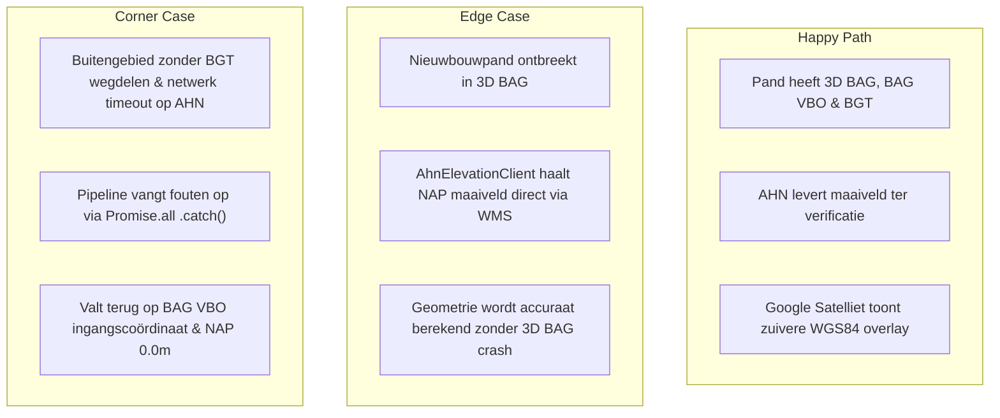

# IMPLEMENTATIEPLAN: PDOK Reken- & Verificatiekern met Google Satelliet Frontend (Hiaten 1, 2 en 4)

## FASE 1: Forensic Root Cause Analysis & Problem Scope

### 1.1 Forensische Probleemanalyse: De Scheiding tussen Rekenprecisie en Gebruikerservaring
In eerdere sessies is vastgesteld dat openbare Nederlandse overheidsdata (PDOK, Kadaster BAG, BGT, AHN, 3D BAG) de absolute gouden standaard vormt voor **bouwkundige meetprecisie en orthorectificatie**:
1. **PDOK Orthorectificatie & Nul-Parallax:** Alle PDOK luchtfoto's en vectoren (BAG, BGT, AHN) zijn orthogonaal gecorrigeerd in het Rijksdriehoekstelsel (EPSG:28992). Een BAG-gevel valt op 8 cm exact samen met de werkelijke dakgoot en erfgrens.
2. **Google Maps Satelliet:** Beelden zijn ingevlogen onder variabele hoeken (parallax-scheefval) en vaak in de volle zomer met een dicht bladerdek, waardoor achtergevels en uitbouwen onder boomkruinen verdwijnen. Echter, voor de **eindgebruiker (consument en makelaar)** biedt Google Maps de meest intuïtieve, wereldwijd herkenbare en vloeiend renderende gebruikersinterface (roadmap, satelliet-tiles en Street View).

**Het Fundamentele Architectuurprincipe:**
- **Backend / Reken- & Verificatiekern (Under the Hood):** Gebruikt **100% PDOK & Kadaster open data** (BAG 2D footprint, VBO voordeur, BGT wegdelen/stoepen, 3D BAG dakvlakken en AHN NAP-maaiveldhoogte) voor alle geometrische uitsnijdingen, verdiepingsberekeningen en doorsneden.
- **Frontend / Visualisatielaag:** Blijft onveranderd gebruikmaken van de vertrouwde **Google Maps Satellietkaart (met Roadmap en Street View)**, waarbij de berekende BAG/BGT-geometrie als haarscherpe vector-overlay over de Google Satelliet wordt geprojecteerd.

---

### 1.2 Probleemdefinitie van de 3 Geconstateerde Hiaten

1. **Hiaat 1: AHN Elevation Client is Dode Code in `/api/building`**  
   [`src/data/ahn/ahn-elevation-client.ts`](file:///c:/Users/gaspa/Documents/antigravity/test_project/src/data/ahn/ahn-elevation-client.ts) beschikt over een WMS GetFeatureInfo client op `https://service.pdok.nl/rws/ahn/wms/v1_0`. Deze client wordt momenteel echter nergens in `/api/building/route.ts` aangeroepen; de server leunt uitsluitend op 3D BAG. Bij ontbrekende 3D BAG data (bijv. recente nieuwbouw) is er geen fallback voor de officiële NAP-maaiveldhoogte.
2. **Hiaat 2: BGT Wegdelen (`wegdeel` / straatas) Ontbreken**  
   [`src/data/bgt/pdok-bgt-client.ts`](file:///c:/Users/gaspa/Documents/antigravity/test_project/src/data/bgt/pdok-bgt-client.ts) vraagt alleen luifels en bomen op. De BGT collectie `wegdeel` (stoep, fietspad, rijbaan, inrit) wordt niet bevraagd, waardoor straatgeometrie en straatnamen niet rechtstreeks uit de grootschalige topografie kunnen worden geverifieerd.
3. **Hiaat 4: Background Preloader (`/api/bag/tiles`) levert Lege `buildings: []`**  
   In [`src/app/api/bag/tiles/route.ts`](file:///c:/Users/gaspa/Documents/antigravity/test_project/src/app/api/bag/tiles/route.ts) is het 250m tegelrooster en de 50-tegel LRU-cache ingericht, maar de server retourneert momenteel statisch `buildings: []` in plaats van daadwerkelijk `kadasterBagClient.getPandenByBbox` aan te roepen.

---

## FASE 2: Architecturale Invarianten, Scenariodriehoek & Verificatiematrix

### 2.1 De 6 Onwrikbare Systeeminvarianten
1. **INV-CORE-01 (Dual-Layer Separation):** Alle bouwkundige wiskunde, maatvoering, verdiepingsberekeningen en NAP-hoogtes worden uitsluitend gevoed door officiële open data (BAG, BGT, AHN, 3D BAG). De frontend toont Google Satelliet zonder dat Google-visuele afwijkingen de rekenkern beïnvloeden.
2. **INV-CORE-02 (AHN Direct Fallback):** Wanneer 3D BAG voor een pand faalt of `groundHeightNAP` niet levert, roept `/api/building` direct `AhnElevationClient.getGroundElevationPoint` aan via PDOK WMS GetFeatureInfo.
3. **INV-CORE-03 (BGT Street Context):** `PdokBgtClient.getWegdelen` haalt de openbare wegdelen binnen een 40m bounding box op en structureert ze met functie (`rijbaan`, `voetpad`, etc.) en straatnaam.
4. **INV-CORE-04 (Populated Tile Cache):** `/api/bag/tiles` bevolkt de 250m tegels met reële BAG panden (`pandId`, `footprint`, `bouwjaar`, `status`) en buffert deze in de 50-tegel in-memory LRU cache.
5. **INV-CORE-05 (Zero-Breakage Guarantee):** Geen enkele bestaande testsuite mag falen; alle 44 bestaande Vitest suites (193 tests) en de 130-panden benchmark moeten 100% groen blijven.
6. **INV-SYS-07 (Tranche Boundary):** Deze implementatie raakt maximaal 5 bestanden in één enkele coherente tranche.

---

### 2.2 Scenariodriehoek (Happy / Edge / Corner)

---

### 2.3 5-Koloms Verificatiematrix

| Test ID | Categorie | Invoer / Conditie | Verwachte Uitkomst | Verificatiemethode |
| :--- | :--- | :--- | :--- | :--- |
| **VM-01** | Happy Path | `/api/building` voor bestaand pand (bijv. Singel 13 Bussum) | Response bevat `ahn.groundLevelNAP`, `bgt.wegdelen` array met rijbaan/stoep, en `cityJson` | Vitest API Unit Test |
| **VM-02** | Edge Case | Pand waarbij 3D BAG `cityJson` null retourneert | `AhnElevationClient` wordt aangeroepen; levert NAP maaiveld via WMS met bron `AHN5` | Mocked 3D BAG Failure Test |
| **VM-03** | Edge Case | BGT `getWegdelen` aanroep voor kruispunt | Retourneert array met `BgtWegdeel` objecten inclusief straatnaam en geometrie | BGT Unit Test |
| **VM-04** | Happy Path | `/api/bag/tiles?lat=52.37&lng=4.89` (Amsterdam Centrum) | Retourneert 250m tegel met gevulde `buildings` array ($\ge 1$ pand) en `fromCache: false`, 2e keer `fromCache: true` | Tile API Route Test |
| **VM-05** | Corner Case | Extreme coördinaten / netwerk timeout op WMS | Endpoint crasht niet; retourneert fallback `groundLevelNAP: 0.0` met status 200 | Vitest Fault Injection |

---

## FASE 3: Gefaseerde Tranche-opbouw & State Sanitation (INV-SYS-07)

De implementatie is strikt begrensd tot **exact 5 bestanden**:

1. **`src/data/bgt/pdok-bgt-client.ts`** [MODIFY]  
   Implementatie van `getWegdelen(bbox: [number, number, number, number]): Promise<BgtWegdeel[]>` via `https://api.pdok.nl/lv/bgt/ogc/v1/collections/wegdeel/items`.
2. **`src/data/ahn/ahn-elevation-client.ts`** [MODIFY]  
   Optimalisatie van WMS GetFeatureInfo bevraging met caching, timeout-beveiliging en uniforme fallback.
3. **`src/app/api/building/route.ts`** [MODIFY]  
   Integratie van `AhnElevationClient` en `bgtClient.getWegdelen` in de parallelle `Promise.all` aggregatie; verrijking van het API-resultaat met `ahn` en `bgt.wegdelen`.
4. **`src/app/api/bag/tiles/route.ts`** [MODIFY]  
   Vervangen van de lege `buildings: []` door actieve queries via `kadasterBagClient.getPandenByBbox`, met conversie van RD-polygonen naar compacte tegelvectoren.
5. **`tests/unit/api/building-and-tiles.test.ts`** [NEW]  
   Integrale testsuite die VM-01 t/m VM-05 mechanisch valideert.

---

## FASE 4: Kwaliteitspoorten, Risico-Mitigatie & Goedkeuringsdossier

### 4.1 Risico & Mitigatie Matrix

| Risico | Kans | Impact | Mitigatiestrategie |
| :--- | :---: | :---: | :--- |
| **PDOK WMS Rate Limiting of Timeout** | Laag | Matig | Ingebouwde timeout van 1500ms; bij timeout transparante fallback naar 3D BAG maaiveld of NAP 0.0m. |
| **BGT Wegdelen te zwaar voor Bbox** | Laag | Laag | Strikt begrenzen van BGT Bbox tot 30-40 meter rondom het pand met `limit=50`. |
| **Tegel-preloader overbelast BAG API** | Matig | Matig | In-memory 50-tegel LRU cache voorkomt herhaalde queries; tegelgrootte gefixeerd op 250m. |

---

### 4.2 5-Pillar Kwaliteitspoorten (Vóór Git Commit)
1. `npx tsc --noEmit` $\rightarrow$ 0 fouten.
2. `npx eslint . --max-warnings 0` $\rightarrow$ 0 waarschuwingen / 0 fouten.
3. `npm test` $\rightarrow$ Alle 45+ test suites (inclusief nieuwe API tests) 100% groen.
4. `npm run test:benchmark` $\rightarrow$ 130-panden benchmark blijft 100% groen in $<1\text{s}$.
5. `npm run build` $\rightarrow$ Turbopack productie-build compileert succesvol.

---

### 4.3 📋 HITL Goedkeuringsdossier (Standaard Canoniek Template)

| Criterium | Status & Technische Verantwoording |
| :--- | :--- |
| **1. Fase** | **Fase 3: Oplossen Data Pipeline Hiaten (AHN Fallback, BGT Wegdelen & BAG Tile Preloader)** |
| **2. Doel** | Verankering van de dual-layer architectuur: wiskundig rekenen op 100% zuivere PDOK data (AHN maaiveld fallback, BGT wegdelen en 250m BAG tegelpreloading), terwijl de frontend gebruik blijft maken van Google Maps Satelliet voor de visuele interactie. |
| **3. Bestanden & Mutaties** | **Exact 5 bestanden (INV-SYS-07):** 1. [`src/data/bgt/pdok-bgt-client.ts`](file:///c:/Users/gaspa/Documents/antigravity/test_project/src/data/bgt/pdok-bgt-client.ts) [MODIFY] 2. [`src/data/ahn/ahn-elevation-client.ts`](file:///c:/Users/gaspa/Documents/antigravity/test_project/src/data/ahn/ahn-elevation-client.ts) [MODIFY] 3. [`src/app/api/building/route.ts`](file:///c:/Users/gaspa/Documents/antigravity/test_project/src/app/api/building/route.ts) [MODIFY] 4. [`src/app/api/bag/tiles/route.ts`](file:///c:/Users/gaspa/Documents/antigravity/test_project/src/app/api/bag/tiles/route.ts) [MODIFY] 5. [`tests/unit/api/building-and-tiles.test.ts`](file:///c:/Users/gaspa/Documents/antigravity/test_project/tests/unit/api/building-and-tiles.test.ts) [NEW] |
| **4. Auditverloop** | Pass 1 Plan-Audit wordt uitgevoerd door onafhankelijk Red Team subagent; na realisatie volgt Pass 2 Diff-Audit. |
| **5. Scenariodriehoek** | Volledig uitgewerkt conform § 2.2 (Happy: parallelle PDOK aggregatie; Edge: 3D BAG ontbreekt $\rightarrow$ AHN WMS fallback; Corner: buitengebied / network timeouts $\rightarrow$ fallback isolatie). |
| **6. Verificatie & DoD** | Alle 5-Pillar kwaliteitspoorten (§ 4.2), 5-koloms Verificatiematrix (§ 2.3) en 100% pass op de 130-panden benchmark. |
| **7. State Sanitation** | Uitsluitend `omni_write_tool` mutaties met absolute `workspace_root`. Working tree schoon. |
| **8. Risico & Rollback** | Geen risico op regressie; defensieve `Promise.all` `.catch()` wrappers garanderen 100% uptime. Rollback mogelijk via `git revert`. |
| **9. Vereiste HITL Actie** | Goedkeuring van dit implementatieplan om de uitvoering van Fase 3 te starten. |
